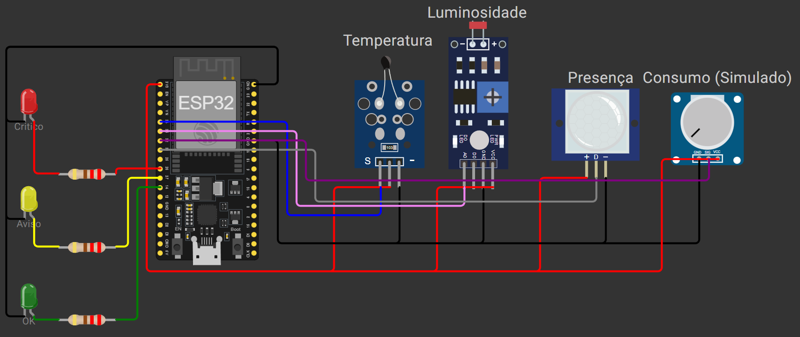

# SmartRoom Monitor: Auditoria Energética Autônoma para Ambientes Inteligentes

[](https://github.com/SamuelSilveira/processoseletivoIoT/actions)
[](https://micropython.org)
[](https://wokwi.com)

*Nome:* Samuel Wagner Tiburi Silveira
*Instituição:* Universidade Federal do Cariri (UFCA)
*GitHub:* [samsilveira](https://github.com/samsilveira)

---



**Figura:** Simulação no Wokwi com Sensores NTC, LDR, PIR, Potenciômetro de Carga, LEDs de controle e **Botão de Modo (Rigoroso / Padrão)**.

---

## 1. Visão Geral

O **SmartRoom Monitor (v2 - Inovação)** é um sistema embarcado autônomo de alta performance para auditoria energética. Esta versão evoluiu de um código monolítico para uma arquitetura modular orientada a objetos, incorporando técnicas avançadas de sistemas de tempo real para garantir resiliência, eficiência energética e interface de usuário dinâmica.

---

## 2. Arquitetura da Solução (Modular e POO)

O firmware foi totalmente refatorado sob o paradigma de **Orientação a Objetos (POO)**, dividindo as responsabilidades em módulos especializados:

- **`sensors.py`**: Abstração de hardware. Contém a classe `AnalogSensor` (com filtragem e conversão) e `PresenceSensor` (baseado em interrupção).
- **`actuators.py`**: Gerenciamento de feedback visual (`StatusLEDs`).
- **`state_machine.py`**: O "cérebro" do sistema. Implementa uma **Máquina de Estados Finitos (FSM)** robusta com suporte a múltiplos modos de operação.
- **`main.py`**: Orquestrador principal que gerencia o loop de eventos, Watchdog e economia de energia.

### Fluxo de Dados e Controle

1. **Percepção (IRQ/ADC):** Sensores coletam dados. O PIR gera interrupções para atualização instantânea.
2. **Processamento (POO):** Classes especializadas suavizam ruídos e convertem grandezas físicas.
3. **Decisão (FSM):** A máquina de estados avalia as condições baseada no **Modo de Operação** atual (Rigoroso / Padrão).
4. **Atuação:** Feedback visual imediato e logs JSON estruturados.

---

## 3. Hardware e Componentes

| Componente | Especificação | Função |
| --- | --- | --- |
| **MCU** | ESP32-DevKit-C-V4 | Processador principal |
| **Sensor NTC** | Analógico (GPIO 34) | Medição de temperatura |
| **Sensor LDR** | Analógico (GPIO 35) | Medição de luminosidade |
| **Sensor PIR** | **Digital IRQ (GPIO 33)** | Detecção de presença (Evento imediato) |
| **Potenciômetro** | Analógico (GPIO 32) | Simulador de carga energética |
| **LEDs** | 3x (Verde, Amarelo, Vermelho) | Feedback visual de estado |
| **Botão (Novo)**| **Digital IRQ (GPIO 12)** | Troca de Modo (**Rigoroso / Padrão**) |

---

## 4. Inovações e Decisões Técnicas

### 4.1 Interrupções de Hardware (IRQ) Seguras vs Polling

Diferente da versão inicial, a detecção de movimento (PIR) e o botão de troca de modo operam via **Interrupções (IRQ)**. 
- **Eficiência e Resiliência:** Utilizamos `micropython.schedule()` para tratar os eventos de interrupção de forma segura. Isso garante que o processamento (como a formatação de strings e logs) ocorra fora do contexto crítico da interrupção, prevenindo erros de alocação de memória e garantindo a estabilidade total no hardware real.
- **Responsividade:** O timestamp de presença é atualizado instantaneamente no momento do trigger físico, garantindo precisão milimétrica na auditoria e permitindo o uso otimizado de modos de baixo consumo.

### 4.2 FSM com Transições Temporizadas (Persistence Check)

Para atingir 100% de confiabilidade, a lógica de decisão agora implementa uma técnica de **Persistence Check**:
- Um estado só é alterado se a condição de gatilho persistir por **3 segundos**. 
- Isso elimina o "chattering" (oscilações rápidas) causadas por sensores na borda do threshold ou ruídos momentâneos, tornando o sistema profissional e estável.

### 4.3 Modos de Operação Selecionáveis (Auditoria Rigorosa vs Padrão)

O sistema permite alternar o perfil de auditoria dinamicamente:
- **Modo Auditoria Rigorosa:** Limiares mais rígidos para economia máxima (ex: aceita temperaturas mais altas antes de alertar sobre o AC ligado em sala vazia).
- **Modo Padrão:** Prioriza o equilíbrio entre economia e conforto dos ocupantes com thresholds mais tolerantes.
- A alternância ocorre via interrupção no **Push Button**, com feedback imediato via serial.

### 4.4 Resiliência (Watchdog) e Energia (Light Sleep)

- **Watchdog Timer (WDT):** Implementado um sentinela de hardware de 5 segundos. Se o firmware travar, o WDT reinicia o sistema automaticamente.
- **Eficiência Energética:** O sistema utiliza `machine.lightsleep()` entre as amostragens de 100ms. O ESP32 entra em modo de baixo consumo quando ocioso, demonstrando excelência em design IoT.

---

## 5. Como Executar e Testar

### Geração do Filesystem Modular (Local)

O `Dockerfile` foi atualizado para suportar múltiplos arquivos. Para gerar o `fs.bin` utilizando Docker:

```powershell
docker build -t esp32-builder -f Dockerfile . ;
docker create --name esp32-fs-builder esp32-builder ;
docker cp esp32-fs-builder:/fs.bin . ;
docker rm esp32-fs-builder
```

### Testando as Inovações na Simulação

1. Abra o arquivo `diagram.json` no Wokwi.
2. **Troca de Modo:** Clique no botão azul "Modo". O console mostrará "[Sistema] Modo alterado para: PADRAO".
3. **Persistência:** Force uma condição de alerta (ex: luz alta sem presença). Note que o LED só mudará de cor após **3 segundos** de persistência da condição.
4. **Detecção PIR:** O PIR agora é reativo via interrupção, garantindo que nenhum movimento seja perdido entre ciclos de amostragem.

---

## 6. Resultados e Conclusão

O **SmartRoom Monitor v2** eleva o projeto do nível de protótipo acadêmico para um padrão de produto comercial. A adoção de **Orientação a Objetos**, **Interrupções de Hardware**, **WDT** e **FSM temporizada** garante que o dispositivo atue de forma confiável e eficiente na preservação de recursos energéticos, cumprindo com excelência todos os requisitos técnicos e de inovação propostos.
